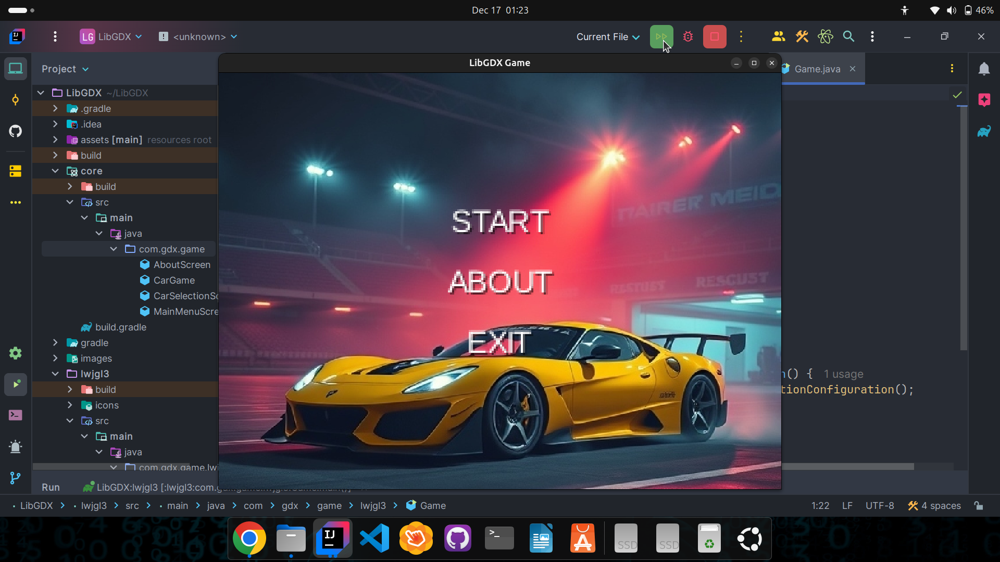
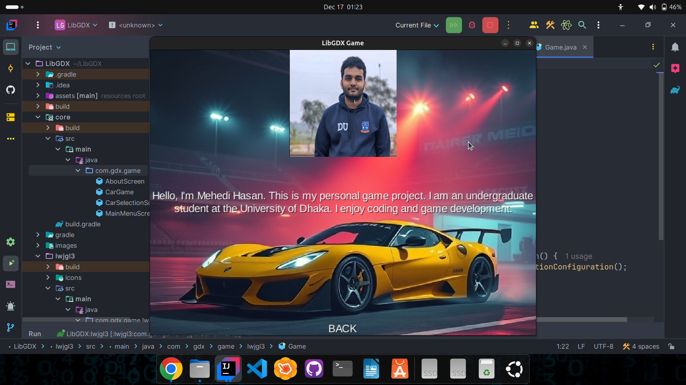
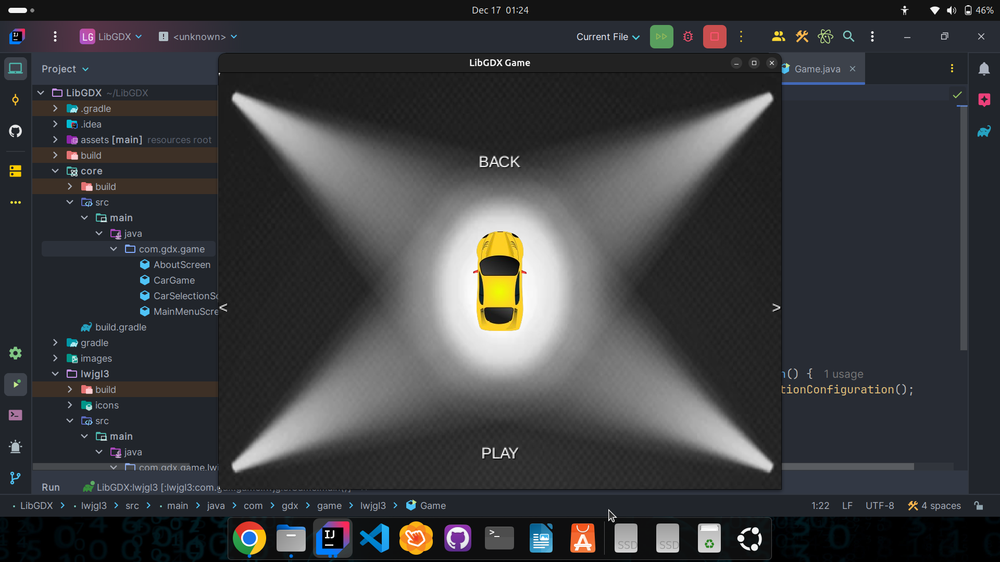
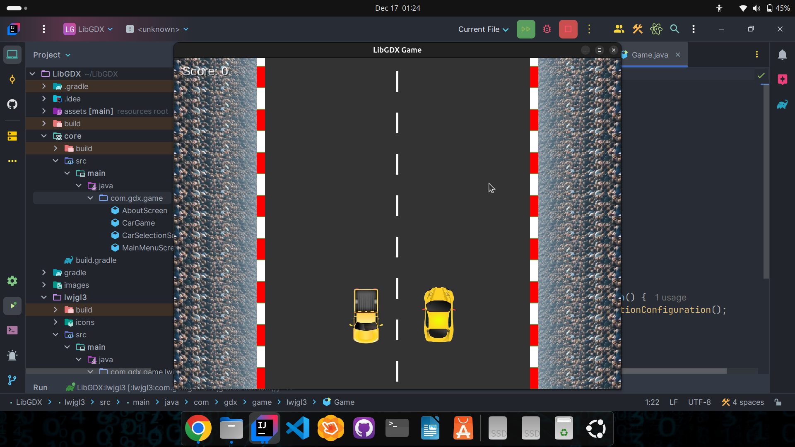
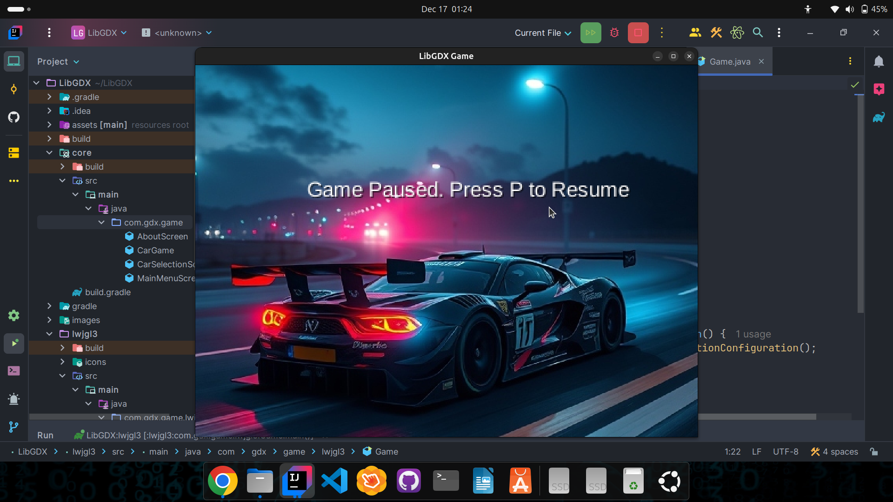
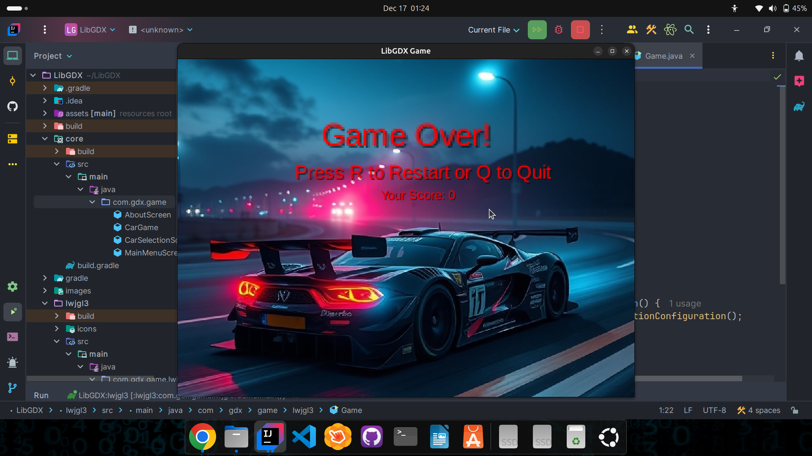

# **LibGDX Car Game 🚗**

Welcome to **Car Selection Game**, an exciting game where players can choose their favorite car and embark on thrilling journeys. This project is developed using **LibGDX**, a cross-platform game development framework, and allows users to interact with the game through a simple and intuitive interface.

---

## **Features ✨**

- **Car Selection 🚙**: Choose from a variety of cars and customize your journey.
- **Smooth Navigation 🧭**: Intuitive navigation with arrow buttons to switch between cars.
- **Play Button ▶️**: Start your adventure with the selected car.
- **Back Button 🔙**: Return to the main menu with ease.
- **Background Music 🎶**: Immerse yourself in the gameplay experience with looping background music.
- **Customizable UI 🖥️**: Enjoy a clean, responsive user interface designed for a seamless experience.

---

## **Game Flow 🔄**

1. **Main Menu 🏠**: The user starts by selecting their car from a list of available options.
2. **Car Selection 🚗**: Use left and right arrow buttons to browse through the car options.
3. **Play ▶️**: Once a car is selected, hit the "PLAY" button to start the game with the chosen car.
4. **Back 🔙**: The "BACK" button allows users to return to the main menu.

---

## **Screenshots 📸**

  
_Screenshot of the main menu screen._

  
_Screenshot of the About screen._

  
_Screenshot of the car selection screen._

  
_Screenshot of the Gameplay screen._

  
_Screenshot of the Pause screen._

  
_Screenshot of the Game Over screen._

---

## **Technologies Used 💻**

- **LibGDX**: A cross-platform game development framework used for creating the game.
- **Java**: The programming language used for game logic and UI design.
- **Texture Files 🖼️**: Custom textures for cars, crowds, and backgrounds.
- **Music 🎶**: Background music to enhance the gaming experience.

---

## **Getting Started 🚀**

To run the project on your local machine, follow these steps:

**1. Clone the Repository 📂:**
```bash
git clone https://github.com/hasan-mehedii/LibGDX.git
```
**2. Setup LibGDX ⚙️:**
     Follow the official LibGDX setup guide to set up the development environment.

**3. Run the Game 🏁:**
     Once LibGDX is set up, open the project in your IDE and run the DesktopLauncher.java class to start the game.

---

### How to Play 🎮
   - **Left Arrow ⬅️:** Select the previous car in the list.
   - **Right Arrow ➡️:** Select the next car in the list.
   - **PLAY ▶️:** Start the game with the selected car.
   - **BACK 🔙:** Go back to the main menu.

---

### Contributing 🤝
   - Contributions are welcome! If you'd like to contribute to the project, please fork the repository, create a new branch, and submit a pull request 
     with your changes.

**Steps to contribute:**
  1. Fork the repository.
  2. Create a new branch:
     ```bash
      git checkout -b feature-branch
      ```
  4. Commit your changes:
     ```bash
      git commit -am 'Add new feature'
      ```
  6. Push to the branch:
     ```bash
      git push origin feature-branch
      ```
  8. Create a new pull request.

---

### Acknowledgements 🙏
   - **LibGDX:** For providing an excellent game development framework.
   - **Open Game Art 🎨:** For the freely available textures and assets used in the game.
   - **Font Awesome 🖋️:** For icons used in the UI.

---

## 🧑‍💻 Author
   - **Mehedi Hasan**
      - 🏫 Undergraduate Student, CSE Department, University of Dhaka
      - 📧 Email: [mehedi-2022415897@cs.du.ac.bd](mailto:mehedi-2022415897@cs.du.ac.bd)
      - 🌐 GitHub: [github.com/hasan-mehedii](https://github.com/hasan-mehedii)

     
